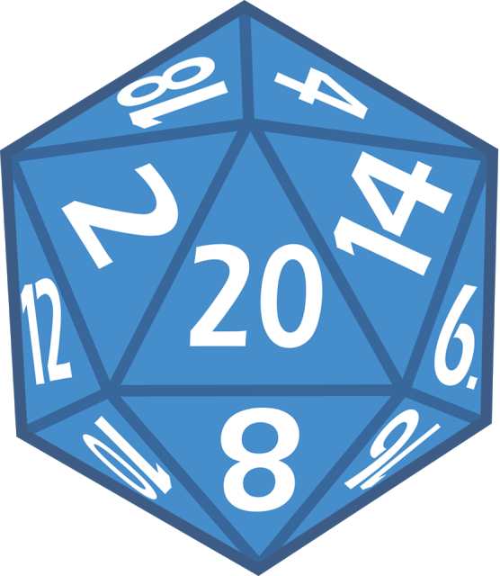

# Tabletop Companion

The tabletop companion is a multi-use tool for Dungeon/Game Masters and players alike with features such as campaign, attribute, stat, skill, enemy, and party tracking, die/dice rolling, character creation, manual references (if available), homebrew set up, and many more features to come. Currently the tool is [hosted on Heroku](https://zeldaplay.herokuapp.com) and is available to use for free. This project is still in early phases of development and is backed by a single developer, so it will take a long time to get this into a ready state for stable use. If you would like to know more about the project [you can email me here](mailto://jmcdo29@gmail.com). This project is written using [NestJS](https://docs.nestjs.com) for the server and [Angular](https://angular.io) as the front end service while using [Nx](https://nx.dev) as a tool for development.

## Built With

